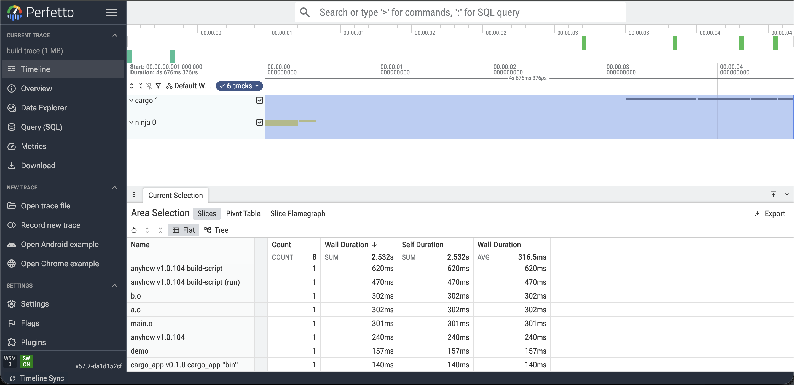

# buildline

[](https://github.com/nabsei/buildline/actions/workflows/ci.yml)

**One timeline for your whole build, no matter how many build systems it's made of.**

Your CI build takes 22 minutes. `cargo build --timings` says cargo is fine.
Ninja's log says linking is fine. Every tool profiles its own silo — and yet
the build is slow. Where did the time actually go?

buildline merges the profiling output your build tools already produce into a
single, unified timeline — cargo, ninja, and more, side by side on one time
axis, opened in [Perfetto](https://ui.perfetto.dev). It's not another
profiler. It's the layer that makes the profilers you already have talk to
each other. Think OpenTelemetry, but for builds.

## It sees the time no profiler sees

Because buildline wraps each build step and stamps the real wall-clock, it
captures the dead time between and around your tools — toolchain downloads,
dependency resolution, environment setup — the minutes that never show up in
any single tool's trace because they happen outside it. That's usually where
the surprise is.

The screenshot below is a real run: a tiny `ninja` build finishes in under a
second, then a real `cargo build` starts about 2.7 seconds later. Neither
tool's own profiler records that gap — ninja doesn't know cargo exists, and
cargo's timer starts from zero when *it* launches. On the merged timeline it's
just... visibly empty space, exactly where the surprise usually is in a real
CI log.



## Installation

With Rust installed:

```bash
cargo install buildline
```

Without Rust — pre-built binaries for Linux, macOS (Intel and Apple Silicon)
and Windows are attached to each [release](https://github.com/nabsei/buildline/releases).

## Try it with no build on hand

```bash
buildline demo
# open demo.trace.json in https://ui.perfetto.dev
```

Writes an illustrative trace (synthetic data, clearly labelled as such) so you
can see the merge mechanism — two tracks, the wall-clock gap between them —
before pointing buildline at a real build.

## Usage

```bash
BUILDLINE_SESSION=./build.trace buildline -- ninja
BUILDLINE_SESSION=./build.trace buildline -- cargo build
# open build.trace in https://ui.perfetto.dev — flamegraph, zoom, drill-down included
```

Each invocation wraps one real tool invocation — run it once per tool, from
wherever you'd normally run that tool. No orchestrator wrapping, no process
interception: `buildline` runs the command transparently (inherited
stdout/stderr, exact exit code passed through), then reads that tool's own
profiling artifact, timestamps it onto the shared session clock, and appends
it to the trace file. There's no finalize step — `build.trace` is a valid,
openable trace after every single invocation.

Supported tools today: **ninja** (`.ninja_log`, written automatically by every
ninja build) and **cargo** (`--timings`, injected automatically if you don't
already pass it — parsed from the report's embedded data, since stable cargo
has no machine-readable `--timings=json` output).

**A note on that cargo parsing, honestly:** it reads `UNIT_DATA`, a JavaScript
array embedded in cargo's `--timings` HTML report. That's cargo's own
dashboard data, not a documented or versioned format — verified empirically
against cargo 1.96.1, not against any spec, because there isn't one. It could
change in a future cargo release without notice. If the cargo golden test
starts failing after a `rustup update`, that's the likely cause — please open
an issue with your `cargo --version` and, ideally, the new HTML report.

## What it is not

- **Not a profiler that competes with `cargo --timings` or ninja's log** — it
  consumes them.
- **Not a visualizer** — it emits standard [Chrome Trace Event
  Format](https://ui.perfetto.dev), Perfetto does the UI.
- **Not for distributed, multi-machine builds yet** — single machine first,
  because you can't align clocks you don't control.

## How it works

Every adapter is a pure function: native tool output in, a list of normalized
`Span`s out — relative to that tool's own start, no wall-clock involved. The
wrapper is a thin layer on top: it stamps the real wall-clock instant each
tool launched, and a `Session` (persisted alongside the trace file) offsets
each batch of spans onto one shared axis.

```rust
pub struct Span {
    pub name: String,       // "serde v1.0", "obj/parser.o" — no tool prefix, track already carries it
    pub category: Category, // Compile | Link | Configure | Resolve | Download | Test | Other(String)
    pub status: Status,     // Success | Failed | Skipped | Incomplete
    pub track: String,      // "cargo", "ninja" — groups rows in Perfetto
    pub lane: u32,          // sub-row for parallel work within a track
    pub start_us: i64,
    pub dur_us: i64,
    pub args: BTreeMap<String, String>,
}
```

`Category` is a closed vocabulary, not a free-form string, on purpose: a
golden test only diffs an adapter against *itself*, so nothing would stop one
adapter emitting `"compile"` and another `"Compile"` — each passing its own
test while the "unified" timeline is silently incoherent. The enum is the
contract that makes it actually one timeline. `Other(String)` is the escape
hatch for genuinely tool-specific states — e.g. cargo's `run-custom-build`
(*running* an already-compiled build script) isn't a compile step, so it
stays `Other` rather than being folded into `Compile`.

See [CATEGORIES.md](./CATEGORIES.md) for what each term means, tool-agnostic —
the bar a new adapter's steps are held to.

## Contributing

Support for a new build system is one file + one fixture pair: a real trace
from that tool, and the exact normalized output it should produce. CI diffs
the two — no human judgment call required to review it.

```
src/adapters/<tool>.rs
tests/fixtures/<tool>/<name>.<native-format>
tests/fixtures/<tool>/<name>.expected.json
tests/golden_<tool>.rs
```

Bring the build system you use that this doesn't support yet — your real
build trace is coverage nobody else can produce.

## Status

Early. Ninja and cargo adapters are golden-tested; the serializer that turns
spans into Chrome Trace events is golden-tested too. Single-machine only. The
cargo adapter reads an undocumented internal format (see above) — it works
today, it isn't guaranteed to keep working.
